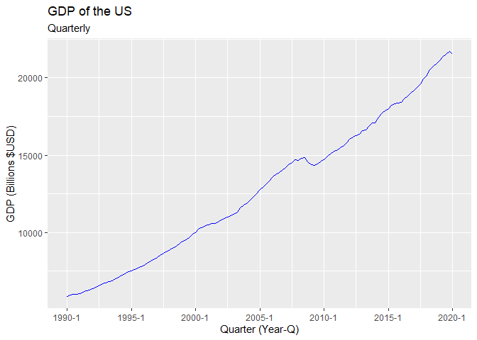
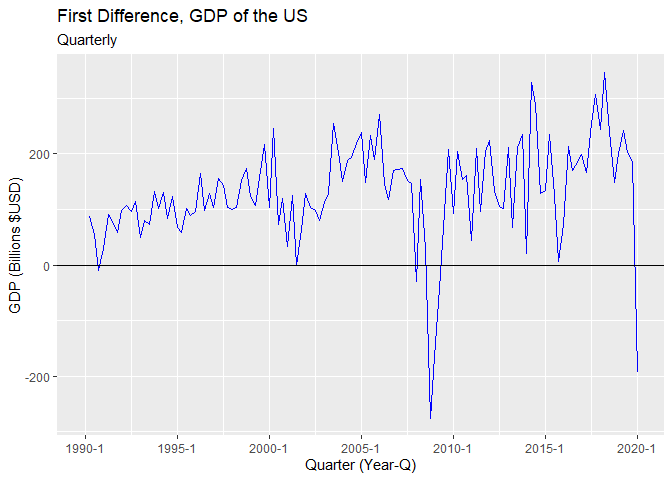
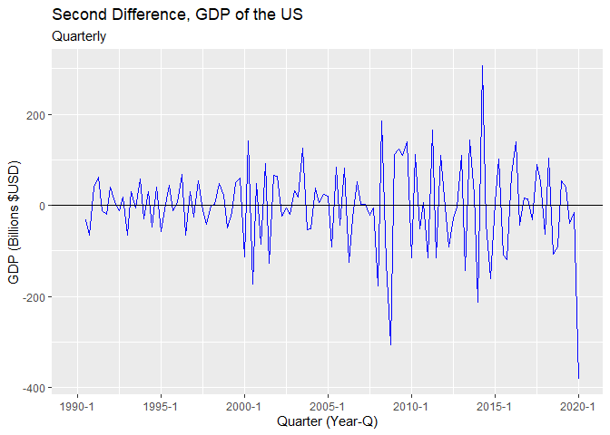
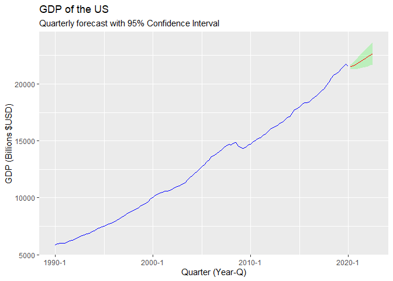

GDP Forecast
================
Ian Bogley
6/12/2020

## ARIMA Forecast: Nominal GDP of the United States

For this project, we will conduct a simple ARIMA model forecast of the
nominal GDP for the US. Note that this forecast does not take into
account the implications of structural changes in the US economy due to
the coronavirus nor the black lives matters demonstrations. As such,
this cannot be considered a comprehensive forecast, only a demonstration
in my ability to use the ARIMA methodology to generate predictions in R.

``` r
    ##Packages##
library(pacman)
p_load(httr,tidyverse,jsonlite,lubridate,zoo,
       ggplot2,tseries,forecast)

    ##Variables##
#FRED specific
api_key   <- Sys.getenv("FRED_API_KEY")
endpoint  <- "series/observations"
#Dates
start     <- as.Date("1990-01-01") 
end       <- as.Date("2020-01-01")
forestart <- as.yearqtr("2020 Q2")
foreend   <- as.yearqtr("2022 Q3")

    ##Data##
params_GDP =
  list(
    api_key   = api_key,
    file_type = "json",
    series_id = "GDP"
)

GDP_URL <- GET(url="https://api.stlouisfed.org/",
             path=paste0("fred/",endpoint),
             query=params_GDP)
GDP_data <- GDP_URL %>%
  content("text") %>%
  fromJSON() %>%
  pluck("observations") %>%
  as_tibble() %>%
  filter(date>=start) %>% filter(date<=end)%>%
  mutate(
    year    = year(date),
    quarter = quarter(date),
    value   = as.numeric(value)
    ) %>%
  unite(quarter, c("year", "quarter"), sep ="-") %>%
  mutate(
    realtime_start = NULL,
    realtime_end   = NULL,
    date           = NULL,
    gdp            = value,
    value          = NULL,
    quarter        = as.yearqtr(quarter),
    d_gdp          = c(NA, diff(gdp)),
    d2_gdp         = c(NA,diff(d_gdp))
    )
GDP_data
```

    ## # A tibble: 121 x 4
    ##    quarter     gdp d_gdp d2_gdp
    ##    <yearqtr> <dbl> <dbl>  <dbl>
    ##  1 1990 Q1   5873.  NA    NA   
    ##  2 1990 Q2   5960.  87.3  NA   
    ##  3 1990 Q3   6015.  55.1 -32.2 
    ##  4 1990 Q4   6005. -10.4 -65.5 
    ##  5 1991 Q1   6035.  30.4  40.8 
    ##  6 1991 Q2   6127.  91.7  61.2 
    ##  7 1991 Q3   6206.  79.1 -12.6 
    ##  8 1991 Q4   6265.  58.6 -20.5 
    ##  9 1992 Q1   6363.  98.6  40.0 
    ## 10 1992 Q2   6471. 108.    9.10
    ## # ... with 111 more rows

Now let’s begin by testing the gdp time series for stationarity. To do
so, we can use the dickey fuller test, with a null hypothesis that there
exists a unit root within the data.

``` r
ggplot(data = GDP_data) +
  geom_line(mapping = aes(
      x = quarter,
      y = gdp
      ), color = "blue") +
  labs(title = "GDP of the US", subtitle = "Quarterly") +
  xlab("Quarter (Year-Q)") + ylab("GDP (Billions $USD)")
```

<!-- -->

``` r
adf.test(GDP_data$gdp)
```

    ## 
    ##  Augmented Dickey-Fuller Test
    ## 
    ## data:  GDP_data$gdp
    ## Dickey-Fuller = -2.5433, Lag order = 4, p-value = 0.3509
    ## alternative hypothesis: stationary

We see that having failed to reject the null hypothesis, there is
evidence of a unit root in the gdp level series. As such, we will first
difference and try again.

``` r
ggplot(data = GDP_data) +
  geom_line(mapping = aes(
    x = quarter,
    y = d_gdp
  ), color = "blue") +
  labs(
    title = "First Difference, GDP of the US", 
    subtitle = "Quarterly"
    ) +
  xlab("Quarter (Year-Q)") + ylab("GDP (Billions $USD)") +
  geom_hline(yintercept = 0)
```

    ## Warning: Removed 1 row(s) containing missing values (geom_path).

<!-- -->

``` r
adf.test(na.remove(GDP_data$d_gdp))
```

    ## 
    ##  Augmented Dickey-Fuller Test
    ## 
    ## data:  na.remove(GDP_data$d_gdp)
    ## Dickey-Fuller = -3.5917, Lag order = 4, p-value = 0.037
    ## alternative hypothesis: stationary

While the dickey fuller test rejects the null hypothesis at the 5%
level, it seems that the auto.arima function prefers to difference
again. I assume this is due to a higher threshold (1% significance leve
as opposed to 5%), so we will abide by the same rule. When looking at
the error that is provided during this step, I would argue that it is
unimportant. I think that the error references that for the first
difference of the data, the first observation is NA, which is why 1 row
is removed from the plot. A similar error occurs in the next step as
well, which I will ignore, subscribing to the reasoning above.

``` r
ggplot(data = GDP_data) +
  geom_line(mapping = aes(
    x = quarter,
    y = d2_gdp
  ), color = "blue") +
  labs(title = "Second Difference, GDP of the US", subtitle = "Quarterly") +
  xlab("Quarter (Year-Q)") + ylab("GDP (Billions $USD)") +
  geom_hline(yintercept = 0)
```

    ## Warning: Removed 2 row(s) containing missing values (geom_path).

<!-- -->

``` r
adf.test(na.remove(GDP_data$d2_gdp))
```

    ## Warning in adf.test(na.remove(GDP_data$d2_gdp)): p-value smaller than printed p-
    ## value

    ## 
    ##  Augmented Dickey-Fuller Test
    ## 
    ## data:  na.remove(GDP_data$d2_gdp)
    ## Dickey-Fuller = -5.7241, Lag order = 4, p-value = 0.01
    ## alternative hypothesis: stationary

With the error stating that the p-values is less than the printed 0.01,
we can state that the null hypothesis is successfully rejected at the 1%
significance level. This implies that we have obtained stationarity and
can proceed with our forecast.

``` r
arima_model <- auto.arima(GDP_data$gdp)
arima_model
```

    ## Series: GDP_data$gdp 
    ## ARIMA(1,2,1) 
    ## 
    ## Coefficients:
    ##          ar1      ma1
    ##       0.4535  -0.9732
    ## s.e.  0.1014   0.0335
    ## 
    ## sigma^2 estimated as 6943:  log likelihood=-695.15
    ## AIC=1396.3   AICc=1396.51   BIC=1404.64

Now that we have selected a model, we can forecast the model into the
future.

``` r
fore <- forecast(arima_model) %>%
  as.data.frame() %>%
  tibble() %>%
  mutate(
    quarter = as.yearqtr(
      seq.Date(as.Date(forestart),
               as.Date(foreend),
               by="quarter")))

ggplot(data = GDP_data) +
  geom_line(mapping = aes(
    x = quarter,
    y = gdp
  ), color = "blue") +
  labs(
    title = "GDP of the US",
    subtitle = "Quarterly forecast with 95% Confidence Interval") +
  xlab("Quarter (Year-Q)") + ylab("GDP (Billions $USD)") +
  geom_ribbon(data = fore, 
              mapping = aes(
                x = quarter,
                ymin = `Lo 95`,
                ymax = `Hi 95`), 
              fill = "green", 
              alpha = .2) +
  geom_line(data = fore, 
            mapping=aes(
              x = quarter,
              y = `Point Forecast`), 
            col = "red")
```

<!-- -->

This shows the current forecast according to the ARIMA model chosen over
the next 10 quarters.
