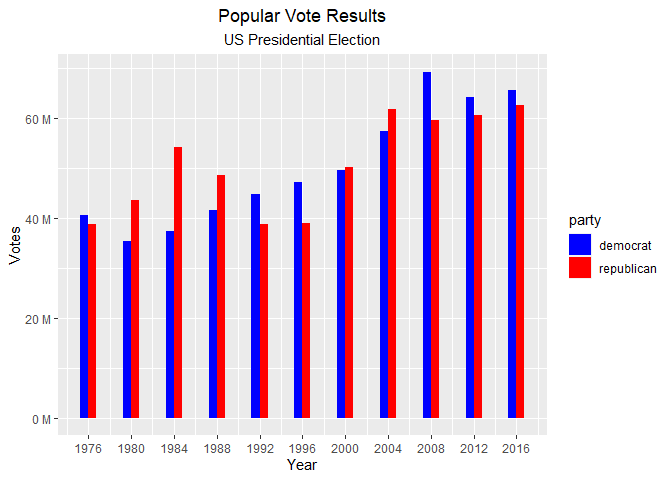
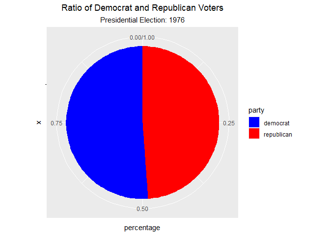

2016 Election Analysis
================
Ian Bogley
6/13/2020

Today, we will query information on the US presidential election from
1976-2016 via the Harvard Dataverse, referenced in the bibliography.

``` r
library(pacman)
```

    ## Warning: package 'pacman' was built under R version 4.0.2

``` r
p_load(here,RSQLite,dbplyr,DBI,tidyverse,ggplot2,scales,gganimate,knitr,gifski,png)
```

Now to read in the data:

``` r
data <- read.csv(here(
  "election/data/1976-2016-president.csv"
  ))
```

Now, we will use sql to query the database. But first, we have to create
a connection to our local data.

``` r
con <- dbConnect(
  RSQLite::SQLite(), 
  path = ":memory:"
  )

copy_to(
  dest = con, 
  df = data
  )
```

Let’s query the database, starting by narrowing down to democrats and
republicans. Then, lets aggregate by year to get the total votes cast
for each party in a presidential election. We will also create a column
with a binary result denoting who won the popular vote, as well as
percentages.

``` sql
SELECT year,party, sum(candidatevotes)
FROM data
WHERE party="democrat" OR party="republican"
GROUP BY year,party
```

``` r
dbDisconnect(conn = con)
dvr_year <- dvr_year_s %>%
  mutate(
    party  = factor(party),
    votes  = `sum(candidatevotes)`,
    'sum(candidatevotes)' = NULL,
    ) %>%
  group_by(year) %>%
  mutate(
    popular    = ifelse(votes==max(votes),1,0),
    percentage = votes/sum(votes)
    )
dvr_year
```

    ## # A tibble: 22 x 5
    ## # Groups:   year [11]
    ##     year party         votes popular percentage
    ##    <int> <fct>         <int>   <dbl>      <dbl>
    ##  1  1976 democrat   40680446       1      0.511
    ##  2  1976 republican 38870893       0      0.489
    ##  3  1980 democrat   35480948       0      0.448
    ##  4  1980 republican 43642639       1      0.552
    ##  5  1984 democrat   37449813       0      0.409
    ##  6  1984 republican 54166829       1      0.591
    ##  7  1988 democrat   41716679       0      0.462
    ##  8  1988 republican 48642640       1      0.538
    ##  9  1992 democrat   44856747       1      0.536
    ## 10  1992 republican 38798913       0      0.464
    ## # ... with 12 more rows

Now, lets use a barchart to show the proportions of voting throughout
the years. Please note that these are counts of the raw vote levels for
the public, not the electoral college delegates.

``` r
ggplot(data = dvr_year) +
  geom_bar(mapping = 
             aes(
               fill  = party, 
               x     = year,
               y     = votes,
               width = 1.5
               ),
           position   =  "dodge",
           stat       =  "identity",
           ) +
  scale_fill_manual(
    values = c("#0000FF","#FF0000")
    ) +
  scale_x_continuous(
    breaks = unique(dvr_year$year)
  ) +
  scale_y_continuous(
    labels = unit_format(unit = "M",scale = 1e-6)
    ) +
  labs(
    title    = "Popular Vote Results",
    subtitle = "US Presidential Election"
    ) +
  xlab("Year") + ylab("Votes") 
```

    ## Warning: Ignoring unknown aesthetics: width

<!-- -->

For our next trick, we will create an animation showing how the ratio of
republican democrat has shifted over time.

``` r
ggplot(dvr_year) +
  geom_bar(mapping = aes(x ="", y = percentage, fill = party), width = 1, stat = "identity") +
  coord_polar("y", start=0) +
  scale_fill_manual(
    values = c("#0000FF","#FF0000")
    ) +
  transition_states(year) +
  labs(
    title = "Ratio of Democrat and Republican Voters",
    subtitle = "Presidential Election: {closest_state}"
    )
```

<!-- -->

## Bibliography

``` bibliography
Data
- author    : MIT Election Data and Science Lab,
- publisher : Harvard Dataverse,
- title     : U.S. President 1976–2016,
- UNF       : UNF:6:Mw0hOUHAijKPTVRAe5jJvg==,
- year      : 2017,
- version   : V5,
- doi       : 10.7910/DVN/42MVDX,
- url       : https://doi.org/10.7910/DVN/42MVDX
```
